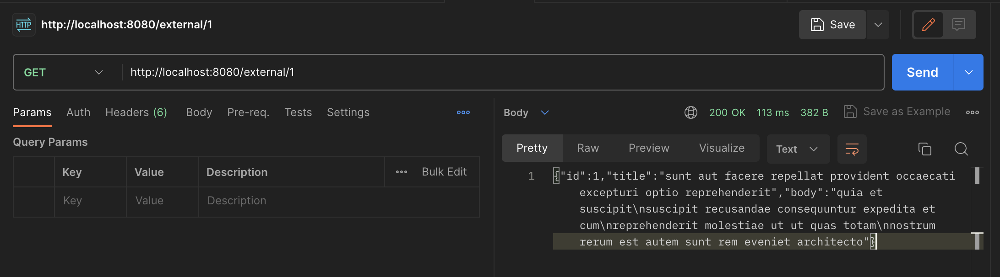
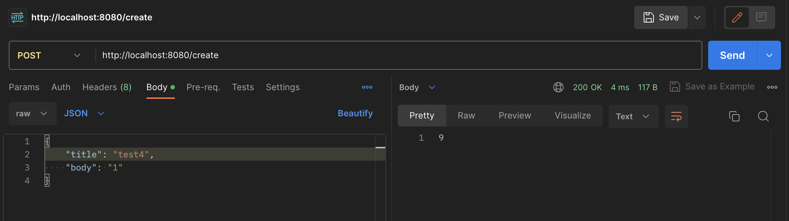
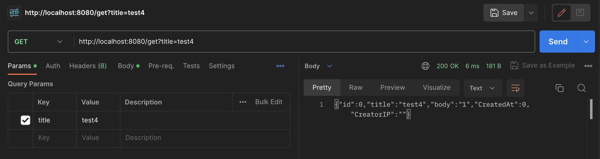

# Pastebin (инвалид-edition)

## О сервисе
Этот сервис - локальная разработка для передачи сниппетов кода, идея аналогична сервису pastebin.com. Сервис позволяет передавать сниппеты кода (или не кода, а просто текста) своим коллегам по уникальной ссылке, которая каждый раз генерируется новая при создании очередного сниппета.

Также поддерживается интеграция с нашей партнерской системой, которая предоставляет свою базу сниппетов

## Как использовать

Для получения сниппета из базы нашего партнера нужно сделать запрос /external/<id>

Для создания собственного сниппета нужно сделать POST запрос /create. В ответ вернется id созданного сниппета

Для получения сниппета по id нужно выполнить GET запрос /get и передать в качестве query-параметра либо id сниппета (id), либо его название (title)

